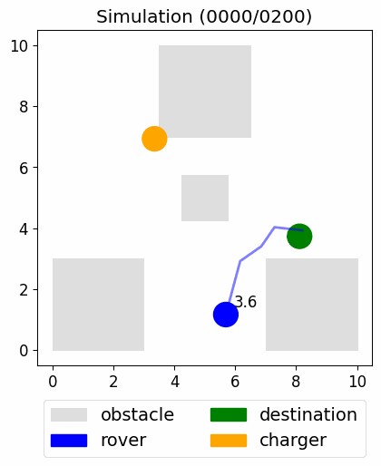
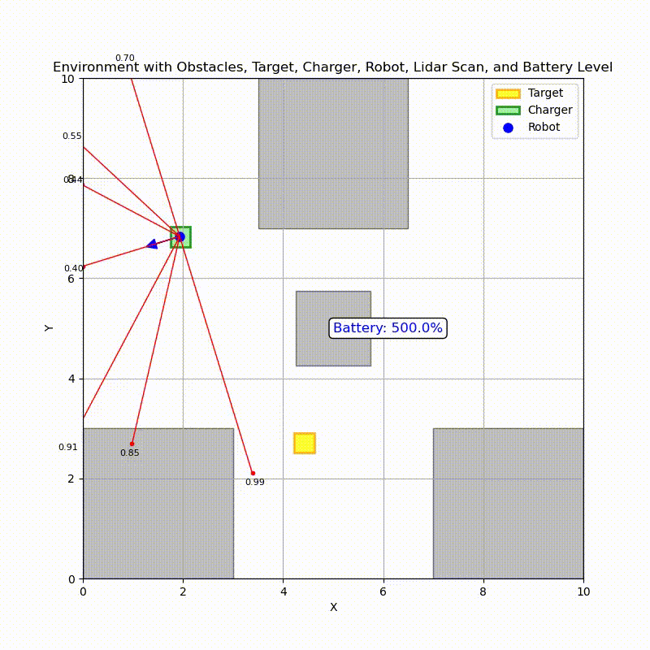

## XAI - Robotics project

This repo contains the code for the project of Robotics in AI and XAI courses.
- [XAI - Robotics project](#xai---robotics-project)
- [:cyclone: Overview and purpose](#cyclone-overview-and-purpose)
- [:whale: Porting of navigation (rover) task to ROS2-Unity](#whale-porting-of-navigation-rover-task-to-ros2-unity)
- [:book: Project structure](#book-project-structure)
- [:syringe: Installation](#syringe-installation)
  - [System requirements](#system-requirements)
- [:trumpet: Running](#trumpet-running)
  - [Train / Test](#train--test)
  - [DQN](#dqn)
  - [STL](#stl)
  - [ROS](#ros)
- [:checkered\_flag: Test result](#checkered_flag-test-result)
  - [Test in graphical env](#test-in-graphical-env)
  - [Test in unity](#test-in-unity)
  - [Test in graphical complex env](#test-in-graphical-complex-env)

**Team members:**
- Davide Bergamasco
- Martina Toffoli

## :cyclone: Overview and purpose 

This project aims to use the **Neural Predictive Control** (npc) method to predict a sequence of actions, given an initial agent state, for a fixed time horizon. The sequence predicted should follow a set of Signal Temporal Logic formula with which safety and task goal contraints are expressed. We take the idea and a small portion of the code from this [paper](https://arxiv.org/abs/2309.05131) and its [code](https://github.com/mengyuest/stl_npc). Specifically, in this project we have ported the Rover task, where an agent must reach a destination without collision or ending its battery. 
We have rethinked the state in a more general way a rewite the STL rules for the collision event. At the end we performed a comparison with a DDQN model with the same state, trained in a Unity envrinoment with ML-agent.

| STL Repository | Our Model | ROS Simulation |
|----------------|-----------|------------------|
|    |  |  |

## :whale: Porting of navigation (rover) task to ROS2-Unity

|                | STL Repository                                                                                                 | Unity Simulation                                                                                      |
|----------------|----------------------------------------------------------------------------------------------------------------|-------------------------------------------------------------------------------------------------------|
| **Need for**   | Exact rover, obstacles, chargers positions, destinations                                                       | Position of rover, target and  nearest charger, lidar values                                          |
| **State**      | Rover's (x, y) position, destination's (x, y) position, charger's (x, y) position, battery time and hold time. | List of lidar values, (dist, heading) for destination and nearest charger, battery time and hold time |
| **Enviroment** | Dynamic destination, always static chargers, static obstacles, battery value, charger handling                 | Dynamic destination inter/infra episodes, dynamic charger pos inter episodes                          |
| **Actions**    | Bounded continuos values : velocity [0, 1] and theta [-pi, pi]                                                 | Bounded continuos values as before                                                                    |

## :book: Project structure

 - `UnityEnvs/`: contains all the unity environment we used during the project, in particular there are three envs with ML-Agents integrated, used for training and testing the models and one for ros demostration.
 - `src/`: main code
   - `DQN/`: code for training the DDQN network (tensorflow)
   - `STL/`: code for training the STL model (Pytorch)
   - `stl_rover/`: ROS2 nodes for ros demostration

## :syringe: Installation

> **This project has been developed and tested on a native installation of Ubuntu 20.04. This linux distro or a derivative of it is required.**

To be able to run this project you will need the following dependecies for a **complete setup**:

### System requirements

1. ROS2 Foxy `ros-foxy-desktop`: [complete instructions here](https://docs.ros.org/en/foxy/Installation/Ubuntu-Install-Debians.html)
2. Turtlebot3 and tf ros packages: `ros-foxy-turtlebot3-msgs ros-foxy-turtlebot3  ros-foxy-tf-transformations`
3. The colcon build system: *on ubuntu* `apt install python3-colcon-common-extensions -y`
4. Anaconda: [miniconda](https://docs.conda.io/projects/conda/en/stable/user-guide/install/linux.html)
5. For ROS nodes you'll need the following packages installed system wide or anyway available ***for the same python interpreter ROS uses*** (`pyhton3.8 -m pip install ...` to be sure):
    - numpy (*mandatory*)
    - tensorflow==2.8.0 (*mandatory*)
    - transforms3d (*mandatory*)
    - wandb (*mandatory*)
    - scipy (*mandatory*)
    - torch==1.13.1+cu117 torchvision==0.14.1+cu117 torchaudio==0.13.1 (*mandatory*)
    - gym==0.20.0 (*optional*)
    - gym_unity==0.28.0 (*optional*)
    - mlagents_envs==0.28.0 (*optional*)
6. For training testing ouside of ROS a conda env is provided with all the necessary dependencies `conda env create -f environment.yml`

The dependencies marked as *optional* are required only for testing/training outside of ROS context.
    

## :trumpet: Running

### Train / Test

### DQN 
 - `conda activate unity-ros`
 - `cd src/DQN`
 - **Train**: `python training_DQN.py`
 - **Test**: `python test_unity.py`

### STL
 - `conda activate unity-ros`
 - `cd src/STL`
 - **Train**: `python training.py --lr=0.0001`
 - **Test in perfect graphic enviroment**: `python test_graphic.py`
 - **Test**: `python test_unity.py`

### ROS

1. `cd src/stl_rover`
2. `colcon build && source install/setup.(bash | zsh)`
3. To start the node with the model of the paper: `colcon build && ros2 run stl_rover paper`
4. To start the node with our model: `colcon build && ros2 run stl_rover STL`

## :checkered_flag: Test result

- **N° of goals reached**: Percetange of episodes ended reaching the goal.
- **Mean Battery**:  The average percentage of the battery average value for each episode.
- **Mean Velocity**: The average of the velocity average value for each episode.
- **Delta Velocity**: Given an array containing lists of velocities at each step for each episode, the velocity delta is represents the average of the difference between each velocity value and the previous one for each step.
- **Safety**:
Set a threshold = 0.15 representing the safe distance to an obstacle, safety is the average percentage of times the lidar, with minimum distance at each step, does not reach below this threshold.
- **Low Battery**: Percetange of episodes ended with battery = 0.
- **Accuracy**: The percentage of how well the robot complies with STL rules.
- **Battery correlation**: The linear correlation between the follwing random variables: low battery and distance to the charger.
- **Collision**: The number of times, as a percentage, that the robot collides to the total number of episodes.
- **Avoid**: The percentage of how well the robot complies onlu the avoid STL rules.
- **Totale distance**: The average of the total distance traveled for each episode.

<!-- START TABLES -->

### Test in graphical env

|Method|Success %|Collision %|Low Battery %|Mean Battery %|Safety %|Accuracy %|Avoid %|Battery correlation|Mean Velocity|Mean Abs Delta Velocity|Total distance|
| :---: | :---: | :---: | :---: | :---: | :---: | :---: | :---: | :---: | :---: | :---: | :---: |
|Paper|76.4|23.5|0.1|91.02 ± 0.7|82.33|20.14|16.66|0.86|0.14 ± 0.08|0.17|0.83 ± 0.41|
|OUR|69.3|26.1|4.6|81.04 ± 1.05|81.39|31.3|17.25|-0.35|0.09 ± 0.03|0.13|0.6 ± 0.27|
|OUR No avoid rule|75.1|24.5|0.4|65.53 ± 1.38|83.24|2.33|16.07|-0.54|0.15 ± 0.05|0.19|0.62 ± 0.3|

### Test in unity

|Method|Success %|Collision %|Low Battery %|Mean Battery %|Safety %|Accuracy %|Avoid %|Battery correlation|Mean Velocity|Mean Abs Delta Velocity|Total distance|
| :---: | :---: | :---: | :---: | :---: | :---: | :---: | :---: | :---: | :---: | :---: | :---: |
|Paper|32.0|47.0|21.0|63.74 ± 1.16|41.18|78.58|24.29|0.17|0.38 ± 0.22|0.43|6.14 ± 3.89|
|DQN|53.0|2.0|19.0|54.15 ± 1.07|100.0|13.45|68.27|-0.04|0.04 ± 0.01|0.01|5.64 ± 3.01|
|OUR|7.0|82.0|11.0|58.47 ± 1.02|57.14|6.95|27.21|-0.21|0.28 ± 0.24|0.35|3.3 ± 3.23|
|OUR No avoid rule|5.0|92.0|1.0|61.42 ± 1.39|100.0|24.57|22.6|-0.34|0.29 ± 0.21|0.51|1.3 ± 0.84|

### Test in graphical complex env

|Method|Success %|Collision %|Low Battery %|Mean Battery %|Safety %|Accuracy %|Avoid %|Battery correlation|Mean Velocity|Mean Abs Delta Velocity|Total distance|
| :---: | :---: | :---: | :---: | :---: | :---: | :---: | :---: | :---: | :---: | :---: | :---: |
|Paper|19.1|80.9|0.0|50.37 ± 0.26|70.98|14.11|7.07|nan|0.49 ± 0.29|0.39|0.5 ± 0.36|
|OUR|31.9|68.1|0.0|51.15 ± 0.29|66.77|31.98|9.51|nan|0.14 ± 0.08|0.23|0.33 ± 0.2|
|OUR No avoid rule|30.8|69.2|0.0|48.09 ± 0.28|72.08|20.07|6.97|nan|0.11 ± 0.04|0.13|0.17 ± 0.08|

<!-- END TABLES -->